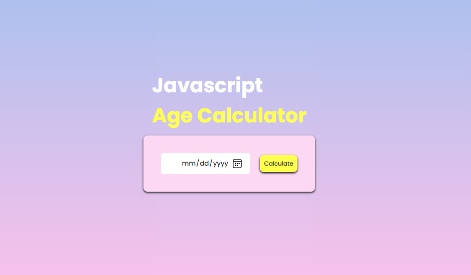
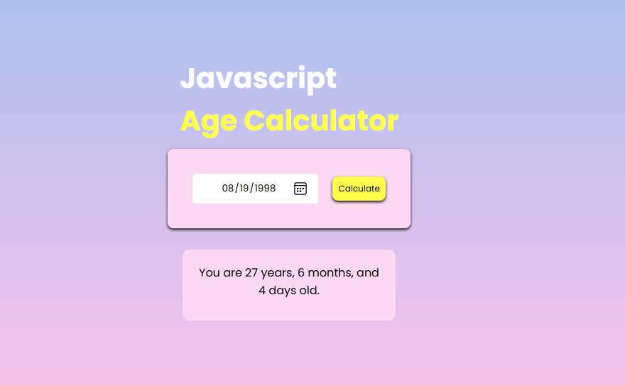

# 📅 Professional Age Calculator

[**🌐 Check Website**](https://gausha606.github.io/agecalculator.github.io/)

## Ek simple, accurate aur elegant web application jo aapki Date of Birth (DOB) ke aadhar par aapki exact age (Years, Months, aur Days mein) calculate karta hai.

## 🚀 Features

- Precise Calculation: Sirf saal hi nahi, balki months aur days tak ki exact jankari.
- Real-time Results: Date select karte hi bina page reload kiye sidhe ek button se instant output.
- Leap Year Support: Logic mein leap years aur mahino ke alag-alag dino (28/30/31) ka poora dhyan   rakha gaya hai.
- Input Validation: Future dates ko select karne se rokne ke liye validation logic.

## 🛠️ Tech Stack

| Technology     | Use Case                                                     |
| :------------- | :----------------------------------------------------------- |
| **HTML5**      | For structure and semantic layout and for date input picker. |
| **CSS3**       | For interactive design and styling.                          |
| **JavaScript** | For calculating and updating age.                            |

## 📦 Installation & Setup

Project ko local machine par chalane ke liye niche diye gaye steps follow karein:

Repository Clone karein:

```Bash
git clone https://github.com/Gausha606/agecalculator.github.io.git
```

Project Folder mein jayein:

```Bash
cd agecalculator
```

Run karein:
`index.html` file ko browser mein open karein (Preferably using Live Server).

---

## 📁 Project Structure

```text
├── index.html          # Main HTML structure
├── style.css           # Styling aur Animations
├── script.js           # DOM update logic
├── Luxon.js            # Age calculation logic
└── README.md           # Project Documentation
```

## 📸 Screenshots



